# Wzmocnij swój głos

Jak głos oddany na daną partę wpływa na przydział mandatów w okręgu:

Dla każdego okręgu przeprowadzane jest 10000 symulacji, losując wyniki
wg podanych średnich i odchyleń standardowych.

Następnie dla każdej sytuacji porównujemy wariant gdzie głosujemy na
partię X z wariantem gdzie nie głosujemy na nic.

Na wykresach pokazana jest wartość oczekiwana tego jak głos wpłynie
na przydział mandatów w okręgu, wyliczona jako średnia z 10000 symulacji.

Dane wzięte z:
[pogonimypis.pl](https://pogonimypis.pl/) (A dokładnie [stąd](https://github.com/krozkwitalski/wybory/blob/master/symulacja.ts).)

Uwaga: w analizach dla uproszczenia nie uwzględniam możliwości, że TD nie przeskakuje
progu wyborczego. W wynikach zakładam, że wszystkie te 5 partii wchodzi do sejmu.

Uwaga2: wyniki zależą od tego jakie odchylenie standardowe przyjmujemy dla poparcia
partii. [Tutaj](half.md) alternatywne wyniki, gdy przyjmiemy 2x mniejsze odchylenie.
[Tutaj](double.md) gdy 2x większe.
## Legnica
```
PIS     38.8 ± 1.2
KONF     8.5 ± 0.4
KO      29.4 ± 1.8
TD       9.8 ± 1.6
LEWICA  13.6 ± 1.4
```
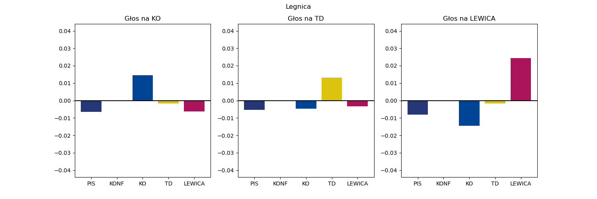

## Wałbrzych
```
PIS     35.8 ± 2.0
KONF     7.3 ± 0.7
KO      37.5 ± 3.5
TD       8.9 ± 1.6
LEWICA  10.4 ± 1.1
```


## Wrocław
```
PIS     29.9 ± 2.3
KONF     9.4 ± 1.4
KO      37.4 ± 1.7
TD       8.8 ± 1.6
LEWICA  14.6 ± 2.4
```


## Bydgoszcz
```
PIS     32.3 ± 2.8
KONF     8.0 ± 1.1
KO      35.9 ± 4.4
TD      11.0 ± 1.6
LEWICA  12.8 ± 2.0
```


## Toruń
```
PIS     36.0 ± 1.6
KONF     8.7 ± 1.5
KO      30.5 ± 3.6
TD      11.7 ± 1.6
LEWICA  13.1 ± 1.8
```


## Lublin
```
PIS     49.4 ± 5.6
KONF    11.6 ± 2.8
KO      23.5 ± 1.0
TD       8.9 ± 1.6
LEWICA   6.6 ± 0.9
```


## Chełm
```
PIS     54.7 ± 9.2
KONF    11.2 ± 4.2
KO      18.1 ± 1.4
TD      10.4 ± 1.6
LEWICA   5.4 ± 1.8
```


## Zielona Góra
```
PIS     29.8 ± 2.2
KONF     8.4 ± 0.7
KO      35.3 ± 2.2
TD      13.3 ± 1.6
LEWICA  13.2 ± 0.9
```


## Lódź
```
PIS     26.7 ± 2.4
KONF     7.0 ± 0.7
KO      40.8 ± 4.2
TD       7.6 ± 1.6
LEWICA  17.9 ± 1.8
```


## Piotrków Trybunalski
```
PIS     51.4 ± 7.4
KONF    10.3 ± 1.4
KO      18.6 ± 1.3
TD      10.3 ± 1.6
LEWICA   9.3 ± 1.0
```


## Sieradz
```
PIS     45.6 ± 5.3
KONF     8.6 ± 0.6
KO      24.7 ± 3.0
TD      10.5 ± 1.6
LEWICA  10.6 ± 1.5
```
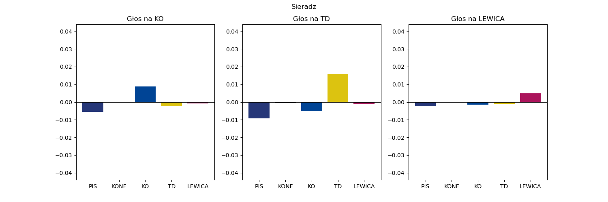

## Chrzanów
```
PIS     47.1 ± 1.3
KONF    11.0 ± 2.3
KO      26.1 ± 1.2
TD       8.9 ± 1.6
LEWICA   6.9 ± 0.8
```


## Kraków
```
PIS     34.1 ± 6.8
KONF     9.4 ± 2.8
KO      34.8 ± 2.8
TD       9.4 ± 1.6
LEWICA  12.3 ± 1.7
```


## Nowy Sącz
```
PIS     59.4 ± 5.0
KONF    12.4 ± 3.2
KO      15.2 ± 4.9
TD       7.7 ± 1.6
LEWICA   5.2 ± 0.9
```


## Tarnów
```
PIS     55.1 ± 3.0
KONF    11.9 ± 2.8
KO      15.4 ± 4.3
TD      12.7 ± 1.6
LEWICA   4.8 ± 0.9
```


## Płock
```
PIS     50.0 ± 4.6
KONF     8.8 ± 0.7
KO      20.1 ± 1.9
TD      13.1 ± 1.6
LEWICA   8.0 ± 1.7
```


## Radom
```
PIS     53.1 ± 6.4
KONF    10.4 ± 1.6
KO      21.2 ± 1.4
TD       9.7 ± 1.6
LEWICA   5.6 ± 1.7
```
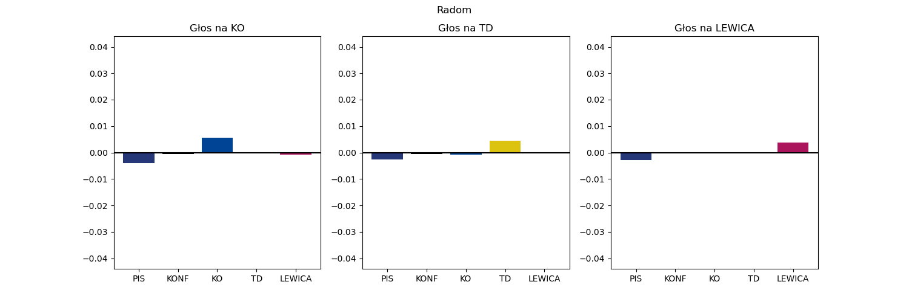

## Siedlce
```
PIS     56.3 ± 7.2
KONF    11.2 ± 3.0
KO      16.9 ± 1.3
TD      10.8 ± 1.6
LEWICA   4.8 ± 1.5
```


## Warszawa I
```
PIS     21.1 ± 6.7
KONF     7.1 ± 2.5
KO      48.1 ± 4.7
TD       7.2 ± 1.6
LEWICA  16.4 ± 2.3
```
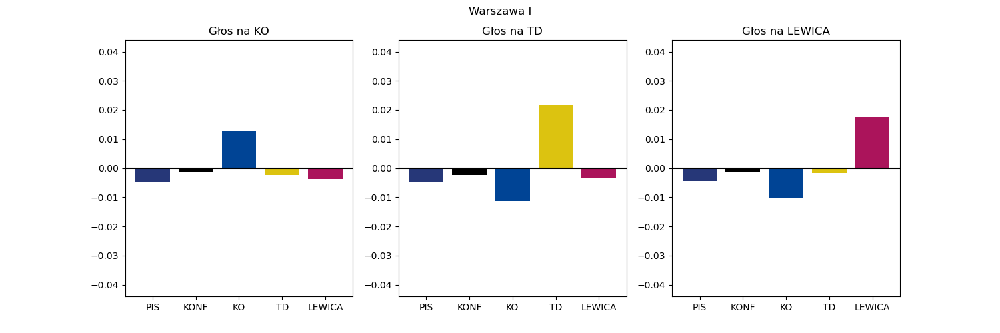

## Warszawa II
```
PIS     35.2 ± 4.0
KONF     8.4 ± 0.8
KO      33.8 ± 1.8
TD      10.2 ± 1.6
LEWICA  12.4 ± 2.0
```


## Opole
```
PIS     36.1 ± 2.7
KONF     9.0 ± 0.8
KO      31.4 ± 2.3
TD      13.0 ± 1.6
LEWICA  10.5 ± 0.5
```


## Krosno
```
PIS     57.0 ± 3.6
KONF    12.3 ± 3.8
KO      18.4 ± 1.8
TD       7.5 ± 1.6
LEWICA   4.7 ± 1.5
```
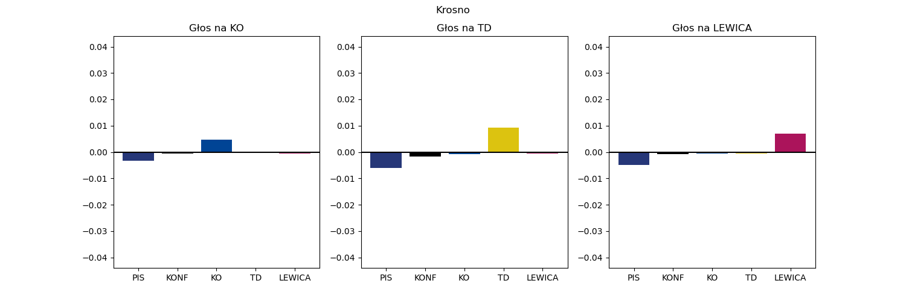

## Rzeszów
```
PIS     55.7 ± 3.0
KONF    14.4 ± 2.7
KO      16.5 ± 2.3
TD       7.9 ± 1.6
LEWICA   5.5 ± 0.8
```
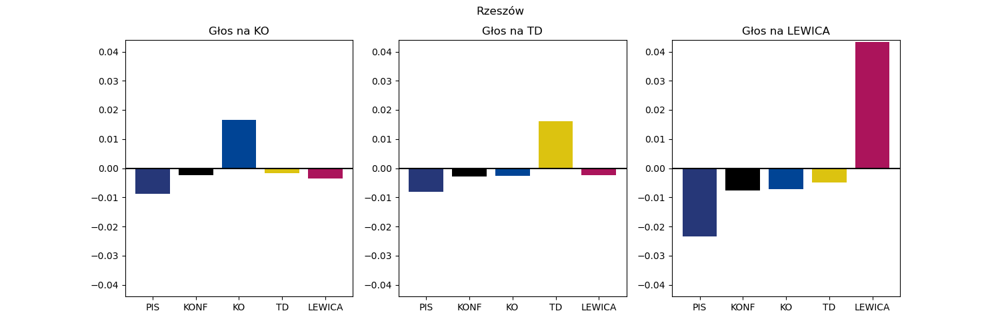

## Białystok
```
PIS     45.9 ± 2.8
KONF    11.2 ± 2.1
KO      24.5 ± 2.1
TD      11.6 ± 1.6
LEWICA   6.8 ± 1.9
```


## Gdańsk
```
PIS     25.7 ± 3.2
KONF     7.9 ± 1.8
KO      46.2 ± 4.3
TD       8.6 ± 1.6
LEWICA  11.7 ± 1.4
```
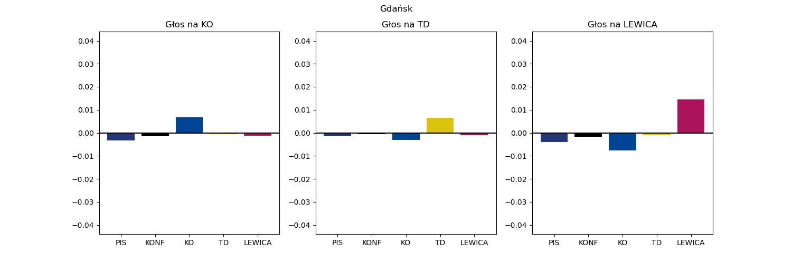

## Gdynia
```
PIS     30.3 ± 2.8
KONF     8.9 ± 0.8
KO      40.5 ± 2.3
TD      10.2 ± 1.6
LEWICA  10.1 ± 0.6
```


## Bielsko-Biała
```
PIS     40.5 ± 4.3
KONF    10.2 ± 1.0
KO      29.9 ± 1.8
TD       9.3 ± 1.6
LEWICA  10.1 ± 0.9
```


## Częstochowa
```
PIS     40.6 ± 1.8
KONF     8.7 ± 1.9
KO      26.3 ± 2.6
TD      10.3 ± 1.6
LEWICA  14.1 ± 2.2
```


## Gliwice
```
PIS     33.4 ± 4.1
KONF     9.5 ± 2.4
KO      36.4 ± 2.5
TD       9.1 ± 1.6
LEWICA  11.6 ± 0.7
```
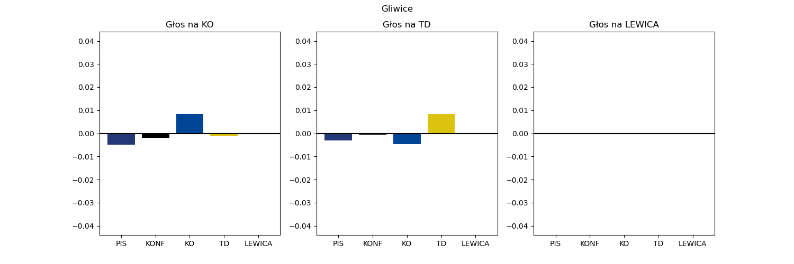

## Rybnik
```
PIS     43.0 ± 3.1
KONF    11.1 ± 1.3
KO      29.9 ± 4.1
TD       8.5 ± 1.6
LEWICA   7.5 ± 1.3
```
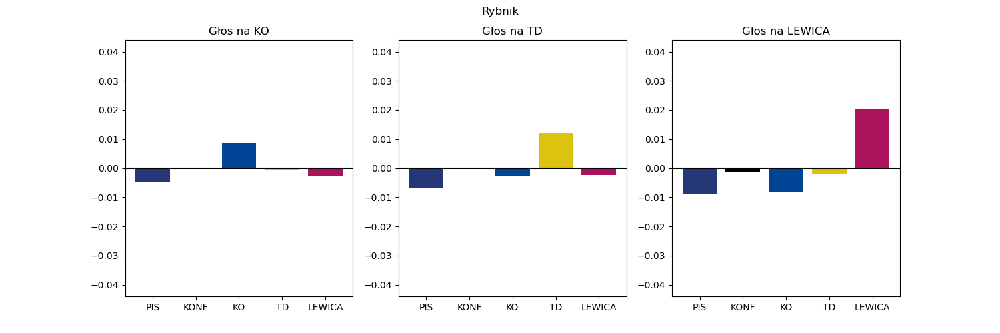

## Katowice
```
PIS     33.2 ± 5.1
KONF     8.1 ± 2.7
KO      40.9 ± 3.4
TD       7.5 ± 1.6
LEWICA  10.3 ± 0.9
```


## Sosnowiec
```
PIS     32.8 ± 2.8
KONF     7.9 ± 0.6
KO      32.7 ± 1.0
TD       7.5 ± 1.6
LEWICA  19.0 ± 1.4
```
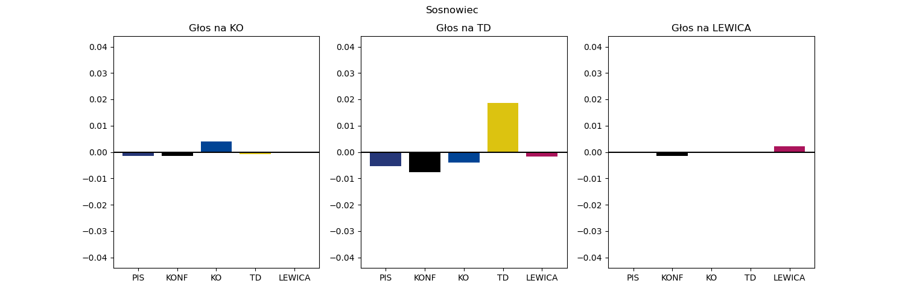

## Kielce
```
PIS     52.8 ± 5.8
KONF    10.2 ± 0.7
KO      20.5 ± 1.4
TD       8.4 ± 1.6
LEWICA   8.1 ± 1.6
```


## Elbląg
```
PIS     37.1 ± 2.8
KONF     8.2 ± 1.8
KO      33.3 ± 3.4
TD      11.3 ± 1.6
LEWICA  10.1 ± 1.2
```


## Olsztyn
```
PIS     34.7 ± 2.2
KONF    10.0 ± 0.5
KO      30.1 ± 2.2
TD      13.2 ± 1.6
LEWICA  12.0 ± 0.9
```
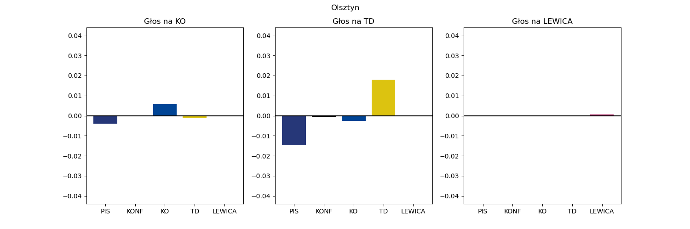

## Kalisz
```
PIS     38.3 ± 3.3
KONF     9.4 ± 0.5
KO      28.7 ± 1.7
TD      13.1 ± 1.6
LEWICA  10.5 ± 1.6
```


## Konin
```
PIS     43.8 ± 5.1
KONF     8.8 ± 1.4
KO      24.2 ± 1.3
TD      10.7 ± 1.6
LEWICA  12.5 ± 2.2
```
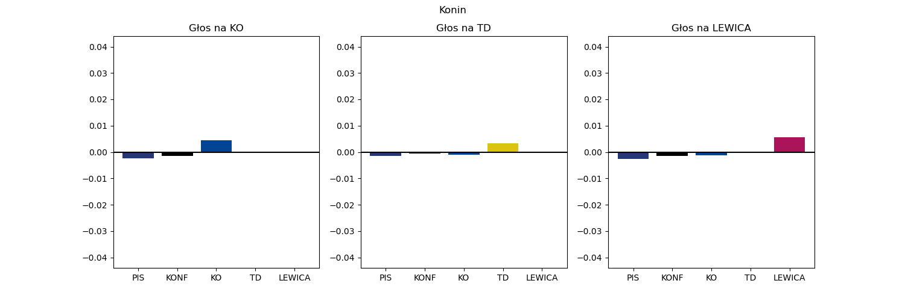

## Piła
```
PIS     31.8 ± 3.0
KONF     8.5 ± 1.1
KO      35.2 ± 3.6
TD      14.3 ± 1.6
LEWICA  10.3 ± 1.9
```


## Poznań
```
PIS     20.1 ± 5.6
KONF     6.9 ± 1.7
KO      50.0 ± 3.5
TD       9.3 ± 1.6
LEWICA  13.7 ± 1.7
```


## Koszalin
```
PIS     32.3 ± 2.6
KONF     7.3 ± 1.7
KO      36.3 ± 4.3
TD      11.3 ± 1.6
LEWICA  12.8 ± 1.3
```


## Szczecin
```
PIS     30.1 ± 2.1
KONF     7.4 ± 1.6
KO      40.6 ± 2.4
TD      10.0 ± 1.6
LEWICA  11.9 ± 1.0
```


# Appendix

Jeden głos rzadko kiedy zmienia przydział mandatów. Dlatego żeby zmniejszyć konieczną
liczbę symulacji, zamiast jednego głosu oddanego na partię X, dodaje jej
̣0.1 punkta procentowego do poparcia w okręgu.

Nie wygląda żeby było to za dużo, bo gdy zmieniłem tą liczbę na 0.01, to wyniki
nie zmieniły się znacząco.

Nie biorę więc tu poprawki na liczbę głosów w danym okręgu, ale są to małe różnice.
