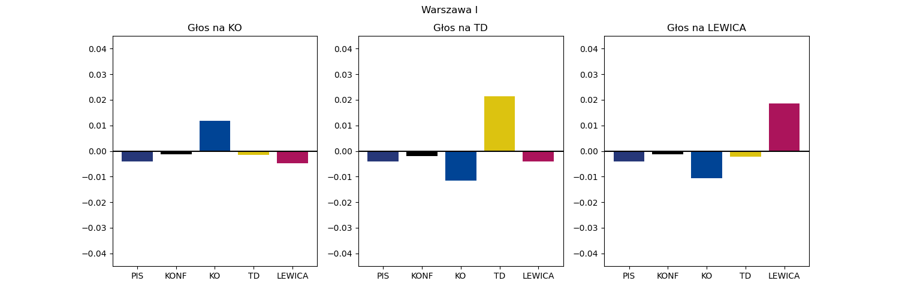
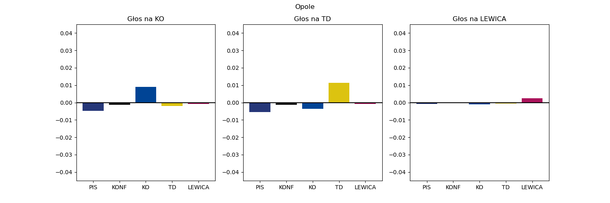
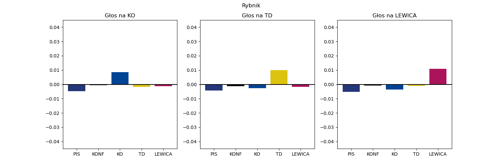
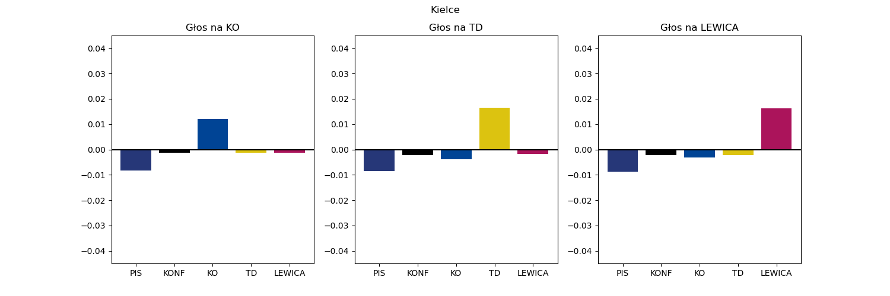
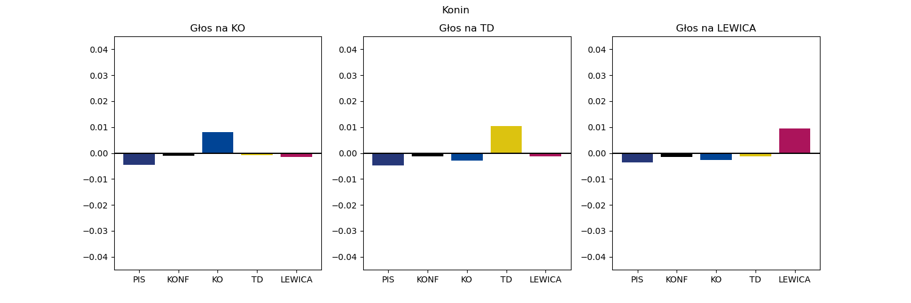
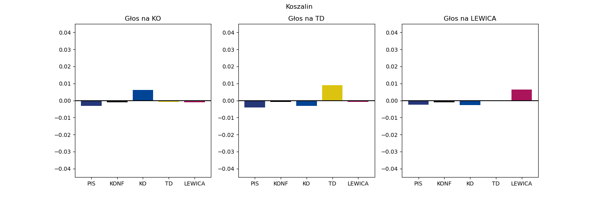

# Podwojona niepewność co do poparcia w okręgach
## Legnica
```
PIS     36.8 ± 2.7
KONF     8.6 ± 1.2
KO      28.1 ± 3.6
TD      12.2 ± 4.0
LEWICA  14.4 ± 3.0
```


## Wałbrzych
```
PIS     34.2 ± 4.1
KONF     7.5 ± 1.7
KO      36.0 ± 6.7
TD      11.2 ± 4.0
LEWICA  11.1 ± 2.5
```


## Wrocław
```
PIS     28.4 ± 4.7
KONF     9.5 ± 2.9
KO      35.7 ± 3.6
TD      10.9 ± 4.0
LEWICA  15.4 ± 5.1
```


## Bydgoszcz
```
PIS     30.5 ± 5.5
KONF     8.1 ± 2.4
KO      34.1 ± 8.4
TD      13.7 ± 4.0
LEWICA  13.5 ± 4.2
```


## Toruń
```
PIS     34.0 ± 3.3
KONF     8.8 ± 3.2
KO      29.0 ± 7.1
TD      14.4 ± 4.0
LEWICA  13.8 ± 3.8
```


## Lublin
```
PIS     47.3 ± 10.7
KONF    11.8 ± 5.8
KO      22.6 ± 2.3
TD      11.2 ± 4.0
LEWICA   7.0 ± 2.1
```


## Chełm
```
PIS     52.3 ± 17.5
KONF    11.5 ± 8.6
KO      17.4 ± 3.0
TD      13.1 ± 4.0
LEWICA   5.8 ± 4.0
```


## Zielona Góra
```
PIS     28.0 ± 4.5
KONF     8.5 ± 1.7
KO      33.4 ± 4.4
TD      16.3 ± 4.0
LEWICA  13.8 ± 2.1
```


## Łódź
```
PIS     25.4 ± 4.8
KONF     7.1 ± 1.6
KO      39.0 ± 8.1
TD       9.5 ± 4.0
LEWICA  19.0 ± 3.9
```


## Piotrków Trybunalski
```
PIS     48.9 ± 14.1
KONF    10.5 ± 2.9
KO      17.8 ± 2.9
TD      12.9 ± 4.0
LEWICA   9.9 ± 2.4
```


## Sieradz
```
PIS     43.3 ± 10.2
KONF     8.7 ± 1.4
KO      23.6 ± 6.0
TD      13.1 ± 4.0
LEWICA  11.2 ± 3.2
```


## Chrzanów
```
PIS     45.1 ± 2.8
KONF    11.2 ± 4.7
KO      25.1 ± 2.6
TD      11.2 ± 4.0
LEWICA   7.4 ± 1.9
```


## Kraków
```
PIS     32.4 ± 13.0
KONF     9.5 ± 5.8
KO      33.3 ± 5.6
TD      11.7 ± 4.0
LEWICA  13.1 ± 3.7
```


## Nowy Sącz
```
PIS     57.2 ± 9.5
KONF    12.8 ± 6.6
KO      14.7 ± 9.5
TD       9.8 ± 4.0
LEWICA   5.6 ± 2.1
```


## Tarnów
```
PIS     52.3 ± 5.9
KONF    12.1 ± 5.8
KO      14.7 ± 8.4
TD      15.8 ± 4.0
LEWICA   5.1 ± 2.2
```


## Płock
```
PIS     47.3 ± 8.9
KONF     8.9 ± 1.6
KO      19.1 ± 3.9
TD      16.2 ± 4.0
LEWICA   8.5 ± 3.8
```


## Radom
```
PIS     50.9 ± 12.3
KONF    10.6 ± 3.3
KO      20.4 ± 2.9
TD      12.1 ± 4.0
LEWICA   6.0 ± 3.7
```


## Siedlce
```
PIS     53.7 ± 13.7
KONF    11.4 ± 6.1
KO      16.2 ± 2.8
TD      13.5 ± 4.0
LEWICA   5.1 ± 3.3
```


## Warszawa I
```
PIS     20.1 ± 12.8
KONF     7.2 ± 5.1
KO      46.1 ± 9.0
TD       9.1 ± 4.0
LEWICA  17.5 ± 5.0
```


## Warszawa II
```
PIS     33.4 ± 7.8
KONF     8.6 ± 1.8
KO      32.2 ± 3.7
TD      12.7 ± 4.0
LEWICA  13.1 ± 4.3
```


## Opole
```
PIS     34.1 ± 5.2
KONF     9.0 ± 1.9
KO      29.8 ± 4.5
TD      16.1 ± 4.0
LEWICA  11.1 ± 1.4
```


## Krosno
```
PIS     54.9 ± 7.1
KONF    12.7 ± 7.7
KO      17.9 ± 3.7
TD       9.5 ± 4.0
LEWICA   5.0 ± 3.2
```


## Rzeszów
```
PIS     53.4 ± 5.8
KONF    14.8 ± 5.6
KO      16.0 ± 4.5
TD       9.9 ± 4.0
LEWICA   5.9 ± 1.9
```


## Białystok
```
PIS     43.6 ± 5.5
KONF    11.4 ± 4.4
KO      23.4 ± 4.1
TD      14.5 ± 4.0
LEWICA   7.2 ± 4.2
```


## Gdańsk
```
PIS     24.5 ± 6.1
KONF     8.1 ± 3.8
KO      44.3 ± 8.4
TD      10.8 ± 4.0
LEWICA  12.4 ± 3.2
```


## Gdynia
```
PIS     28.8 ± 5.5
KONF     9.0 ± 1.8
KO      38.8 ± 4.6
TD      12.7 ± 4.0
LEWICA  10.7 ± 1.6
```


## Bielsko-Biała
```
PIS     38.6 ± 8.3
KONF    10.4 ± 2.1
KO      28.7 ± 3.7
TD      11.7 ± 4.0
LEWICA  10.8 ± 2.1
```


## Częstochowa
```
PIS     38.5 ± 3.8
KONF     8.8 ± 4.0
KO      25.1 ± 5.1
TD      12.8 ± 4.0
LEWICA  14.9 ± 4.6
```


## Gliwice
```
PIS     31.8 ± 8.0
KONF     9.7 ± 4.9
KO      34.8 ± 5.0
TD      11.4 ± 4.0
LEWICA  12.3 ± 1.6
```


## Rybnik
```
PIS     41.1 ± 6.1
KONF    11.3 ± 2.7
KO      28.8 ± 7.9
TD      10.7 ± 4.0
LEWICA   8.0 ± 2.8
```


## Katowice
```
PIS     31.9 ± 9.8
KONF     8.3 ± 5.6
KO      39.4 ± 6.7
TD       9.5 ± 4.0
LEWICA  11.0 ± 2.0
```


## Sosnowiec
```
PIS     31.2 ± 5.6
KONF     8.1 ± 1.5
KO      31.3 ± 2.3
TD       9.4 ± 4.0
LEWICA  20.1 ± 3.1
```


## Kielce
```
PIS     50.6 ± 11.1
KONF    10.5 ± 1.7
KO      19.7 ± 3.0
TD      10.6 ± 4.0
LEWICA   8.6 ± 3.5
```


## Elbląg
```
PIS     35.2 ± 5.5
KONF     8.3 ± 3.7
KO      31.8 ± 6.6
TD      14.1 ± 4.0
LEWICA  10.7 ± 2.6
```


## Olsztyn
```
PIS     32.6 ± 4.4
KONF    10.0 ± 1.4
KO      28.4 ± 4.3
TD      16.3 ± 4.0
LEWICA  12.6 ± 2.2
```


## Kalisz
```
PIS     36.1 ± 6.4
KONF     9.5 ± 1.3
KO      27.2 ± 3.5
TD      16.2 ± 4.0
LEWICA  11.0 ± 3.5
```


## Konin
```
PIS     41.5 ± 9.7
KONF     9.0 ± 2.9
KO      23.1 ± 2.8
TD      13.3 ± 4.0
LEWICA  13.2 ± 4.8
```


## Piła
```
PIS     29.8 ± 5.9
KONF     8.5 ± 2.4
KO      33.2 ± 6.9
TD      17.7 ± 4.0
LEWICA  10.7 ± 4.2
```


## Poznań
```
PIS     19.1 ± 10.7
KONF     7.0 ± 3.5
KO      47.8 ± 6.8
TD      11.6 ± 4.0
LEWICA  14.5 ± 3.7
```


## Koszalin
```
PIS     30.6 ± 5.1
KONF     7.4 ± 3.5
KO      34.6 ± 8.3
TD      14.0 ± 4.0
LEWICA  13.5 ± 2.9
```


## Szczecin
```
PIS     28.6 ± 4.2
KONF     7.5 ± 3.3
KO      38.8 ± 4.8
TD      12.5 ± 4.0
LEWICA  12.6 ± 2.3
```


